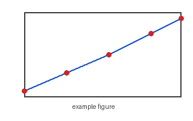

# Supplementary Results

Because this draft's metadata sets `supplementary: true`, the figure and table below are numbered with an S prefix automatically: @fig:supp_demo becomes "Figure S1" and Table \ref{tbl:supp_demo} becomes "Table S1".



```xlsx-table
file: ../figs/example_data.xlsx
sheet: Data
caption: Supplementary descriptive statistics.
label: tbl:supp_demo
skip_n: 0
```
